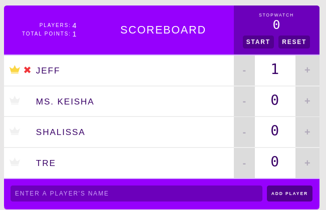

# practice-scoreboard

working repo for react practice

Practice using TeamTreehouse project for React Components.
Dec 30, 2019

As I run through more JS training, I'll add my notes [here](https://www.notion.so/handsomezebra/Node-js-a2147e7011f1407ea69219e0a97f2aa2)

I have the build deployed [here](https://hz-practice-scoreboard.netlify.com/)
